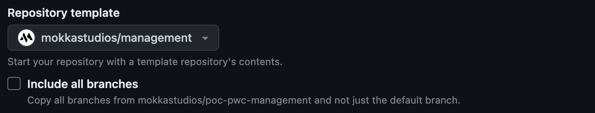
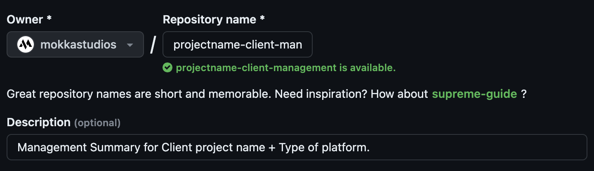
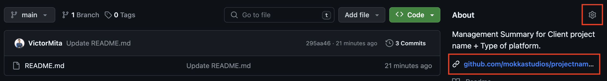
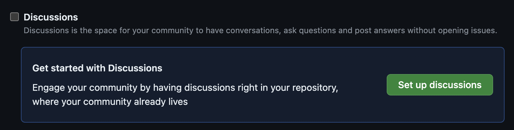

status: new

# GitHub Documentation

## Introduction

Welcome to the PM GitHub Documentation Guide. This guide is structured to provide a comprehensive and detailed process for setting up and managing a project management repository on GitHub. It is tailored specifically for using the `mokkastudios/management` template, ensuring a streamlined and efficient repository setup.

## Repository Setup

### Repository Initialization

#### Repository Template Selection

   - Opt for the `mokkastudios/management` template.
   - Do not copy all branches during the setup process.

#### Repository Details

   - **Title:** Structure as "`project name` - `client` - `management`".
   - **Description:** Formulate as "Management Summary for `Client project name` + `Type of platform`."
   - **Website:** Assign `https://github.com/mokkastudios/projectname/discussions`.

#### Repository Privacy
   - Confirm the repository is private.

### Repository Configuration

#### README File
   - Customize the `README.md` to reflect your project's specifics.

## Discussion and Documentation

### Enabling GitHub Discussions
Repository owners and people with write access can enable GitHub Discussions for a community on their public and private repositories. The visibility of a discussion is inherited from the repository the discussion is created in.

1. On GitHub.com, navigate to the main page of the repository.
2. Under your repository name, click _Settings_.
3. Scroll down to the "Features" section and click Set up discussions.

### Managing Discussion Categories
   - Erase current categories, leaving a clean slate.
   - Establish new categories:
       - **📝 Reports**
         - Description: "Weekly project progress updates."
         - Format: Announcement
       - **❓ Questions**
         - Description: "Queries about project features."
         - Format: Question / Answer
       - **💻 Development**
         - Description: "Technical specifications and guidelines."
         - Format: Announcement
       - **🎨 Design**
         - Description: "Design principles and UI standards."
         - Format: Announcement

#### Documentation Section
   - Create a "Documentation" section for Development and Design materials.

### Documentation Management

#### Creating Discussions
   - **Reports Category:** Implement a template for regular updates.
   - **Design Documentation:** Introduce a Figma link for design insights.
   - **Development Documentation:** Discuss Gitflow, CI/CD, and Deployment.
   - **Architectural Scheme:** Initiate a conversation on the project's architecture.