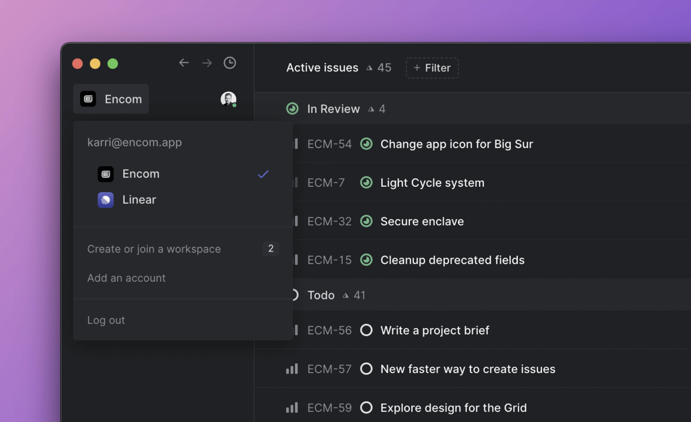
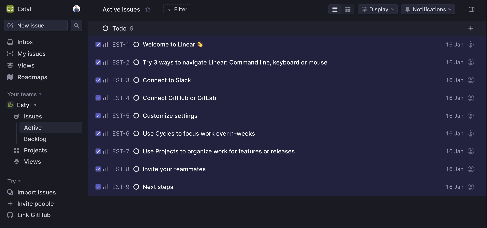
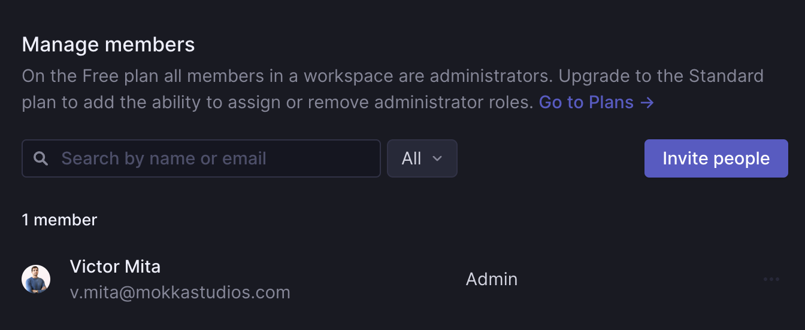
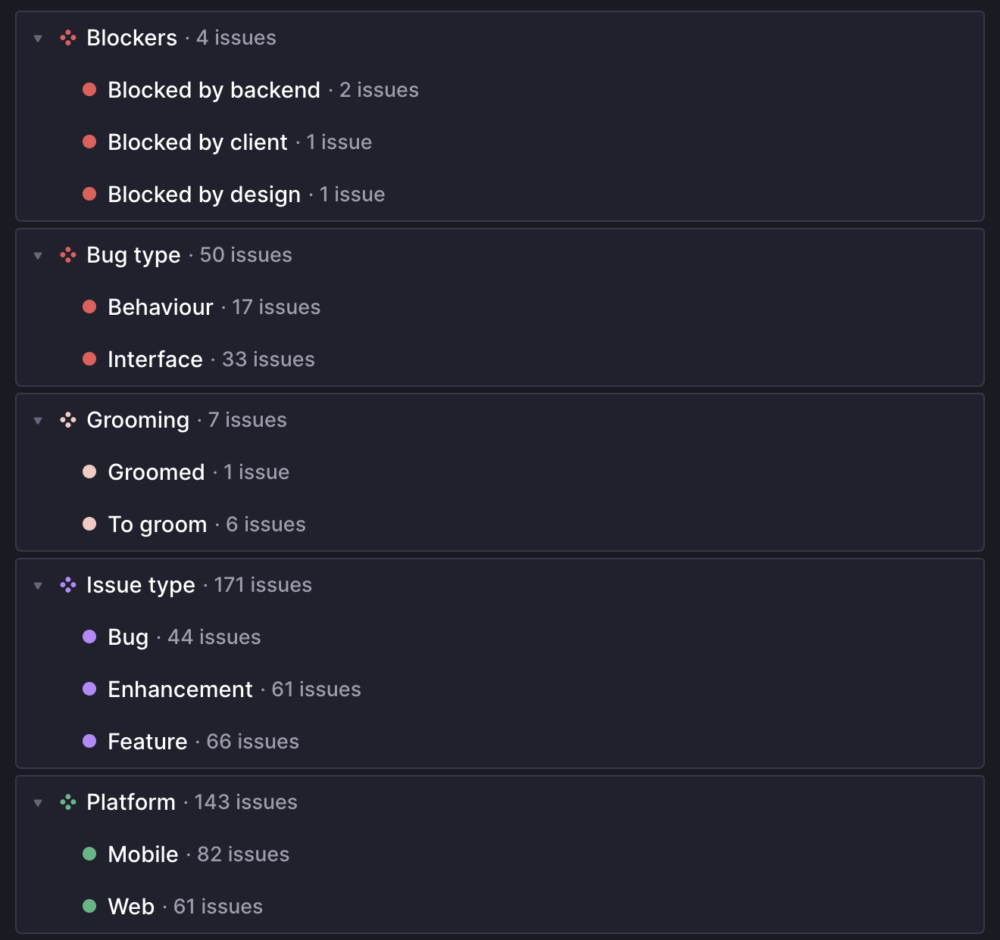
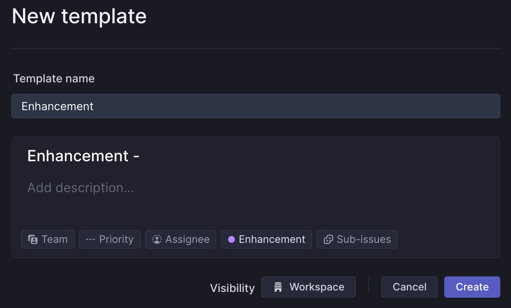
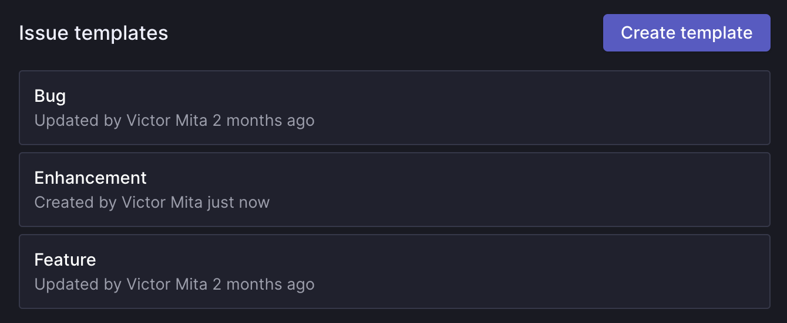
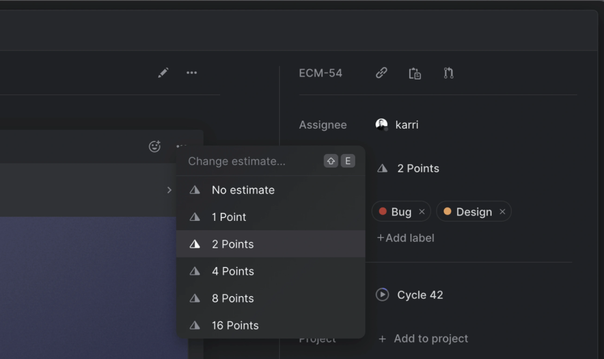
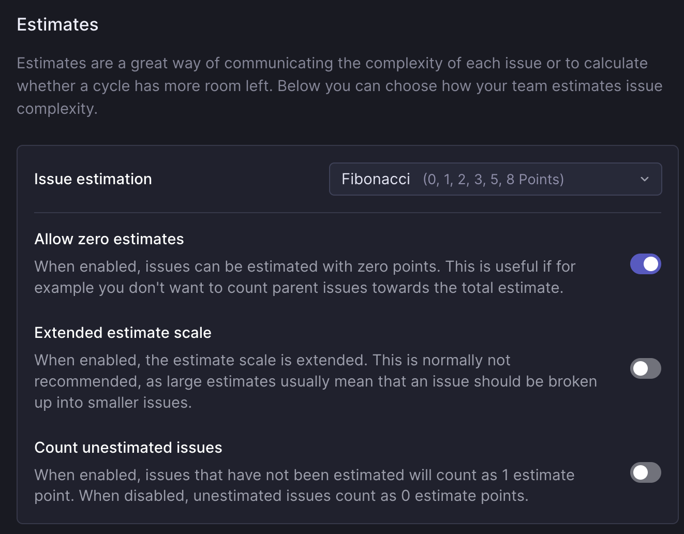
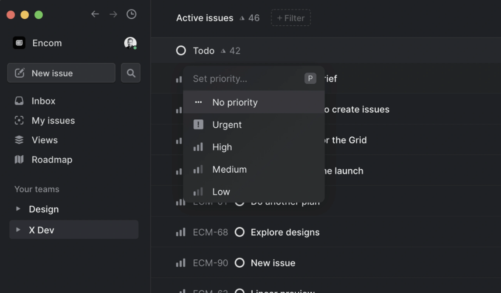

status: new

# Linear

## Overview

The first step to using Linear is to create a workspace for your team. Your workspace is your home in Linear where all issues and interactions live.

When you create your workspace, Linear automatically creates a default Team with the same name. You can create additional teams later in settings.

To create a new workspace:

1. **Starting Point**: Click on "Create or join a workspace" or access [this link](https://linear.app/join).
2. **Personalizing Your Workspace:**
    - **Workspace Name:** This is how you identify your project. If your project is yet to be named, feel free to use the client's name. Think of it as the title of your project's story.
    - **Workspace URL:** Here's where your project lives on the web. Ideally, it should match your project's name for easy recognition. If that's already taken, get creative by combining the `project name` with keywords like `-app` or `-team`.

## Board Setup

In Linear, the most frequent and essential activity is managing issues. As you begin setting up your workspace, you'll notice that Linear populates your board with some template tasks. These are there to help you get started, but you'll likely want to clear them to make way for your actual tasks.

### Clearing Default Tasks

1. **Navigate to Your Board:** This is where you'll see the list of pre-added template tasks.
2. **Select All Tasks:** Simply use the keyboard shortcut `CMD + A`. This will highlight all the tasks on your board.
3. **Delete the Tasks:** Once all tasks are selected, use the shortcut `CMD + Backspace`. This command will remove all the selected tasks, giving you a clean slate to start with.

By clearing these initial tasks, you are ready to add your own issues to fit your project's needs.

## Configure

### Workspace Logo

Navigate to [Settings > Workspace > General](https://linear.app/settings/workspace/general) to add a workspace logo.(1)
{ .annotate }

1. Recommended size is between 256x256 and 1024x1024 pixels.

### Manage Members

Manage members under [Settings > Workspace > Members](https://linear.app/settings/members).(1) 
{ .annotate }

1. The workspace members page is different from team members pages.

Access this page using:

- **Keyboard:** Press `G` then `S` to go to settings, then navigate to _Workspace > Members_.
- **Mouse:** Click on your Avatar, select _Settings_, and go to _Workspace > Members_.

**Invite Members**

1. Go to [Settings > Workspace > Members](https://linear.app/settings/members) to invite full members.
2. Paste multiple emails separated by commas. Invited users will receive an email with an invite link.

**Disable Invite Links**

For project security, disable the invitation links.

## Labels

Create labels to organize issues. 

- Apply labels to any issue with the shortcut `L`.
- Create, edit, or delete labels under [workspace label settings](https://linear.app/settings/labels) or team settings.

Create the following labels:

1. **Blockers:**  (Red) Identify tasks blocked by any stakeholder.
    - `Blocked by backend`
    - `Blocked by client`
    - `Blocked by design`
2. **Bug type:**  (Red) Classify bugs by UI or behavior.
    - `Behaviour`
    - `Interface`
3. **Grooming:**  (Blue) Nearly all tasks need grooming.
    - `Groomed`
    - `To groom`
4. **Issue type:**  (Purple) Specify the type of issue.
    - `Bug`
    - `Enhancement` (Not in the scope)
    - `Feature` (In the scope)
5. **Platform:**  (Green)
    - `Mobile`
    - `Web`

## Templates

Use issue templates to streamline issue creation and ensure relevant information is included.

### Creating Templates

Navigate to workspace or team template settings. Create the issue as desired, then press Save and name the template.

Create the following templates:

1. **Bug:**
    - Title: `Bug - `
    - Labels:
        - `Issue type: Bug`
        - `Bug type: Interface`
    - Visibility: `Workspace`
2. **Feature:**
    - Title: `Feature - `
    - Labels:
        - `Issue type: Feature`
    - Visibility: `Workspace`
3. **Enhancement:**
    - Title: `Enhancement - `
    - Labels:
        - `Issue type: Enhancement`
    - Visibility: `Workspace`

### Template Properties

- Workspace templates are available to all teams but can't specify team-specific properties.
- Team templates are only usable by the respective team.

### Sub-Issues and Placeholders

- Include sub-issues by selecting the "_+ Add sub-issue_" option during template creation.
- Use placeholder text in templates to prompt for specific information in the issue's description.

## Roadmaps

The roadmap provides a timeline of all projects in your company's workspace.

- To disable roadmaps for your workspace, go to [Workspace Roadmaps Settings](https://linear.app/settings/roadmap). Disabling this will remove the Roadmap icon from the sidebar.

## Estimates

Use estimates to describe the complexity or size of an issue. 

- Enable estimates under _Team Settings > General_.
- Choose the Fibonacci scale for estimation.

### Zero Estimates

Toggle the option for zero estimates in estimate settings. By default, unestimated issues count as one point, but this can be changed.

## Priority

Set priority for issues to manage their importance.

- Linear issues have no priority by default.
- Add priorities: low, medium, high, and urgent. Use the shortcut `P` to set priority quickly.
- Change settings so issues without a priority appear last in list views, under _Team Settings > General_.

