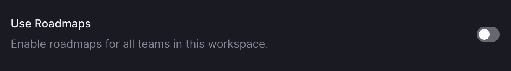

status: new

# Linear

## Overview

The first step to using Linear is to create a workspace for your team. Your workspace is your home in Linear where all issues and interactions live.

When you create your workspace, Linear automatically creates a default Team with the same name. You can create additional teams later in settings.

To create a new workspace:

1. **Starting Point**: Click on "Create or join a workspace" or access [this link](https://linear.app/join).
2. **Personalizing Your Workspace:**
    - **Workspace Name:** This is how you identify your project. If your project is yet to be named, feel free to use the client's name. Think of it as the title of your project's story.
    - **Workspace URL:** Here's where your project lives on the web. Ideally, it should match your project's name for easy recognition. If that's already taken, get creative by combining the `project name` with keywords like `-app` or `-team`.

## Board Setup

In Linear, the most frequent and essential activity is managing issues. As you begin setting up your workspace, you'll notice that Linear populates your board with some template tasks. These are there to help you get started, but you'll likely want to clear them to make way for your actual tasks.

### Clearing Default Tasks

1. **Navigate to Your Board:** This is where you'll see the list of pre-added template tasks.
2. **Select All Tasks:** Simply use the keyboard shortcut `CMD + A`. This will highlight all the tasks on your board.
3. **Delete the Tasks:** Once all tasks are selected, use the shortcut `CMD + Backspace`. This command will remove all the selected tasks, giving you a clean slate to start with.

By clearing these initial tasks, you are ready to add your own issues to fit your project's needs.

## Configure

### Workspace Logo

Navigate to [Settings > Workspace > General](https://linear.app/settings/workspace/general) to add a workspace logo. :material-information-outline:{ title="Recommended size is between 256x256 and 1024x1024 pixels." }

### Manage Members

Manage members under [Settings > Workspace > Members](https://linear.app/settings/members). :material-information-outline:{ title="The workspace members page is different from team members pages."}

Access this page using:

- **Keyboard:** Press `G` then `S` to go to settings, then navigate to _Workspace > Members_.
- **Mouse:** Click on your Avatar, select _Settings_, and go to _Workspace > Members_.

**Invite Members**

1. Go to [Settings > Workspace > Members](https://linear.app/settings/members) to invite full members.
2. Paste multiple emails separated by commas. Invited users will receive an email with an invite link.

**Disable Invite Links**

For project security, disable the invitation links.

## Labels

Create labels to organize issues. 

- Apply labels to any issue with the shortcut `L`.
- Create, edit, or delete labels under [workspace label settings](https://linear.app/settings/labels) or team settings.

Create the following labels:

1. **Blockers:**  (Red) :material-information-outline:{ title="Identify tasks blocked by any stakeholder."}
    - `Blocked by backend`
    - `Blocked by client`
    - `Blocked by design`
2. **Bug type:**  (Red) :material-information-outline:{ title="Classify bugs by UI or behavior."}
    - `Behaviour`
    - `Interface`
3. **Grooming:**  (Blue) :material-information-outline:{ title="Nearly all tasks need grooming."}
    - `Groomed`
    - `To groom`
4. **Issue type:**  (Purple) :material-information-outline:{ title="Specify the type of issue."}
    - `Bug`
    - `Enhancement` :material-information-outline:{ title="Not in the scope"}
    - `Feature` :material-information-outline:{ title="In the scope"}
5. **Platform:**  (Green)
    - `Mobile`
    - `Web`

## Templates

Use issue templates to streamline issue creation and ensure relevant information is included.

### Creating Templates

Navigate to workspace or team template settings. Create the issue as desired, then press Save and name the template.

Create the following templates:

1. **Bug:**
    - Title: `Bug - `
    - Labels:
        - `Issue type: Bug`
        - `Bug type: Interface`
    - Visibility: `Workspace`
2. **Feature:**
    - Title: `Feature - `
    - Labels:
        - `Issue type: Feature`
    - Visibility: `Workspace`
3. **Enhancement:**
    - Title: `Enhancement - `
    - Labels:
        - `Issue type: Enhancement`
    - Visibility: `Workspace`

### Template Properties

- Workspace templates are available to all teams but can't specify team-specific properties.
- Team templates are only usable by the respective team.

### Sub-Issues and Placeholders

- Include sub-issues by selecting the "_+ Add sub-issue_" option during template creation.
- Use placeholder text in templates to prompt for specific information in the issue's description.

## Roadmaps

The roadmap provides a timeline of all projects in your company's workspace.

- To disable roadmaps for your workspace, go to [Workspace Roadmaps Settings](https://linear.app/settings/roadmap). Disabling this will remove the Roadmap icon from the sidebar.

## Estimates

Use estimates to describe the complexity or size of an issue. 

- Enable estimates under _Team Settings > General_.
- Choose the Fibonacci scale for estimation.

### Zero Estimates

Toggle the option for zero estimates in estimate settings. By default, unestimated issues count as one point, but this can be changed.

## Priority

Set priority for issues to manage their importance.

- Linear issues have no priority by default.
- Add priorities: low, medium, high, and urgent. Use the shortcut `P` to set priority quickly.
- Change settings so issues without a priority appear last in list views, under _Team Settings > General_.

## Preferences

To maintain consistency across our company's Linear workflows, the following interface preferences are mandatory:

Navigate to [Settings > Account > Preferences](https://linear.app/settings/account/preferences) to configure:

- **Display Full Names**: `Enabled`. Users are identified by full names rather than usernames.
- **Use Pointer Cursors**: `Disabled`. The standard cursor remains for all interactive elements.
- **Font Size**: Set to `Large`. This ensures text is easily readable.
- **First Day of the Week**: Set to `Monday` for uniformity in scheduling and planning.
- **Check Spelling**: `Enabled`. This ensures all text fields are checked for spelling errors to maintain professionalism in communications.

## Notifications

Issue notifications are directed to your Linear Inbox by default. You have the option to activate notifications for desktop, Slack, and email if needed. Desktop notifications are compatible with both macOS and Windows, as well as with most web browsers.

Access your settings via [Settings > Account > Notifications](https://linear.app/settings/account/notifications).

Within the settings, uncheck all boxes for desktop and email notifications. The Slack notification toggles should remain enabled if the integration is active.

## Cycles

Cycles are short, time-boxed periods of time where a team works on completing a pre-defined set of work. 

When enabled, Linear will automatically create upcoming cycles for your team. Any issues not completed in a cycle are automatically moved to the next cycle at the end of the cycle's cooldown period.

To access these settings, click on the `...` icon next to the team name in your Linear sidebar and select the appropriate options under the team settings. Or by navigation to _Settings > Team settings > Cycles_. :material-information-outline:{ title="Remember, these settings are individual to each team and must be configured separately."}

- **Cycles Start On**: `Monday`. This aligns the cycle with the start of the workweek, providing a clear beginning for sprint activities.
- **Each Cycle Lasts**: `1 or 2 Weeks`. You can select the duration that best fits your team's sprint schedule.
- **Cooldown After Each Cycle**: `No cooldown`. This allows consecutive cycles to run back-to-back without a break, maintaining momentum.
- **Active Issues Are Required to Belong to a Cycle**: `Enabled`. This ensures that all active issues are tracked within a cycle, providing structure and accountability for ongoing work.

## Teams

In your workspace, create Teams to organize members into groups like design, engineering, and marketing. When you create a workspace, a default team is generated with the same name as the workspace. You can be part of multiple teams and decide how to best structure them.
All members of a workspace can view and join teams, provided the teams are not set to private.

### Creating and Managing Teams

1. **Creating Teams**: Go to [workspace settings](https://linear.app/settings) and click the _+ Add team_ button in the sidebar. When creating new teams, you have the option to copy settings from an existing team. Use this function when having already a team.

2. **Accessing Team Settings**: Hover over a team name in the sidebar, click the `···` menu, and then choose _Team settings_. Alternatively, open [workspace settings](https://linear.app/settings) and navigate through the sidebar.

3. **Customizing Teams**: In the Team settings page, you can change the team icon to a Linear icon or an emoji. Customize the team name and identifier here. Suggested identifiers include:
    - Mobile frontend team: `Mobile` with `MOB` as ID
    - Web frontend team: `Web` with `WEB` as ID
    - Backend team: `Backend` with `BE` as ID
    - Design team: `Design` with `DES` as ID

### Key Considerations

- **Issue Management**: Issues are specific to teams.
- **Workflow Customization**: Each team can have unique workflow statuses, catering to the needs of different areas like engineering, design, or marketing.
- **Cycle Management**: Cycles are team-specific. While schedules can be aligned, viewing multiple team cycles simultaneously is not possible.
- **Project Sharing**: Projects can be shared across teams, allowing for both organization-wide and team-specific roadmaps.

## Workflow 

Workflows in Linear help manage the lifecycle of issues within a team, from beginning to completion. Each team has a default workflow, but it can be tailored to fit unique processes.

### Default Structure
Teams in Linear start with a preset workflow sequence:

- **Backlog**: New issues that have yet to be prioritized.
- **Todo**: Issues that are prioritized but not started.
- **In Progress**: Issues that are currently being worked on.
- **Done**: Completed issues.
- **Canceled**: Issues that are no longer in progress or needed.
- **Duplicate**: Issues that are duplicated.

### Customizing Workflows
You can personalize the workflow for each team. To modify the workflow:

1. Navigate to _Settings > Teams > Workflow_ in Linear.
2. Add or edit statuses by clicking the `+` sign or the status itself.
3. Within the **Started** category, add a `To Review` status to indicate issues awaiting review. Assign it a blue color for distinction.
4. Update the `Done` status color to green to clearly mark the completion of an issue.

### Workflow Considerations
- Remember, workflows are unique to each team and can be reorganized to best reflect the team's process.
- Consistency in workflow across teams can aid in uniform reporting and understanding across the organization.
