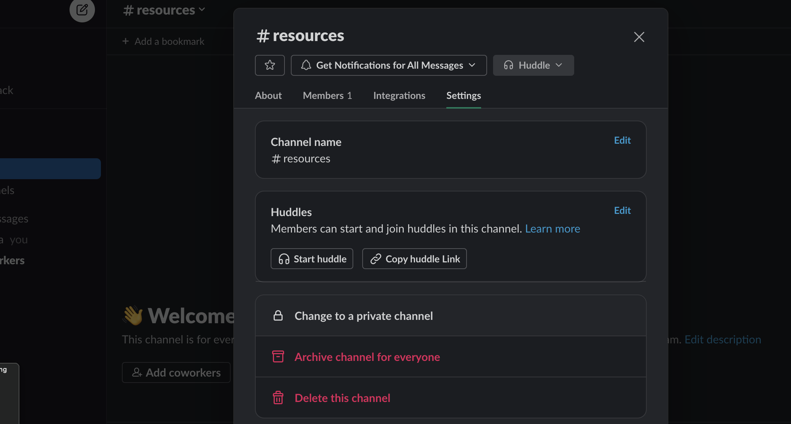

status: new

# Slack Workspace Setup Guide

## Overview

Creating a Slack workspace is essential for team communication and collaboration. As the primary owner, you'll be able to customize the workspace, manage channels, and invite team members. Use your company's email address for workspace creation to maintain professionalism and security.

### Workspace Creation

1. **Starting Point**: Visit [Slack's Workspace Creation Page](https://slack.com/get-started#/createnew) or click `+` in the left navigation bar and select `Create a new workspace`.
2. **Setting Up**: Enter your company email, opt out of the Slack Newsletter, and click **Continue**.
3. **Confirmation Code**: Check your email for a code and enter it to proceed.
4. **Finalizing Workspace**: Click **Create a Workspace** and set the workspace name to your project's name or a creative alternative.

### Initial Setup

- **Full Name and Profile Photo**: Use your full name and upload your company profile photo for identification.
- **Inviting Team Members**: Add team members later. Initially, focus on setting up the workspace.
- **Initial Channel Creation**: Create a private "resources" channel during the onboarding process.
- **Setting Workspace Icon**: Use a 1024x1024 icon, preferably the same as in Linear, for brand consistency.

## Workspace Channels

Channels help organize conversations by project, topic, or team. Customize your workspace with various channels.

### Channel Management

1. **Creating Channels**: From the sidebar, click **Channels**, then select **Create a channel**.
2. **Channel Settings**: Name the channel, set it to private, and add members or skip for now.
3. **Default Channels**: Modify the default channels as follows:
    - Delete the `#random` channel.
    - Make `#resources` private.
    - Create specific channels, including `#design`, `#dev-resources`, `#development`, `#internal`, and `#deliverables`.

## Inviting Team Members

Owners, admins, and members can invite new members in the free version of Slack.

1. **Access Invitation Settings**: Click your workspace name in the top left, then select **Invite people to [workspace name]**.
2. **Sending Invites**: Enter the email addresses of those you wish to invite and click **Send**.

## Additional Topics (To Be Developed)

- Bookmarks
- Pinned Messages
- Adding Clients
- Joining Channels
- Other Settings
- Explanation of each channel
- How to use dev and normal resources channels
- Who are the people that you have to invite
- Add some new images

